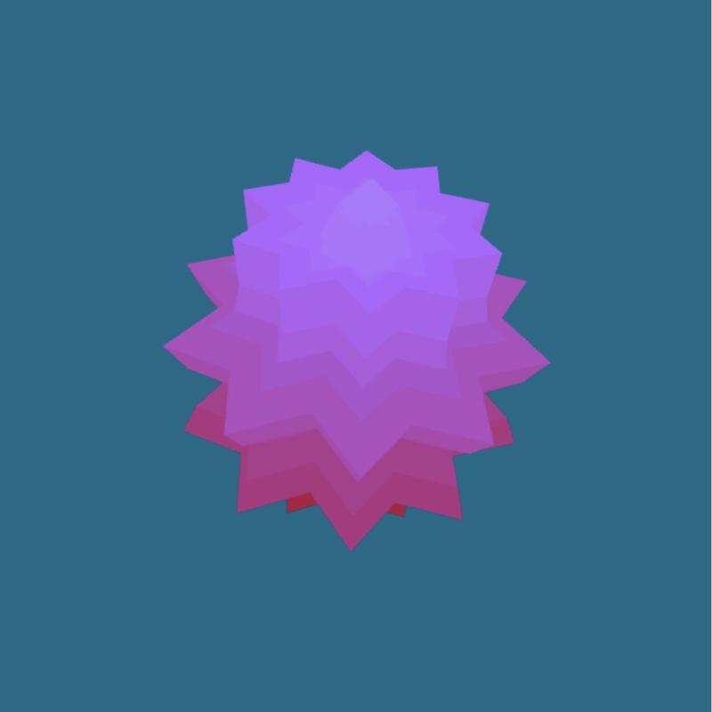
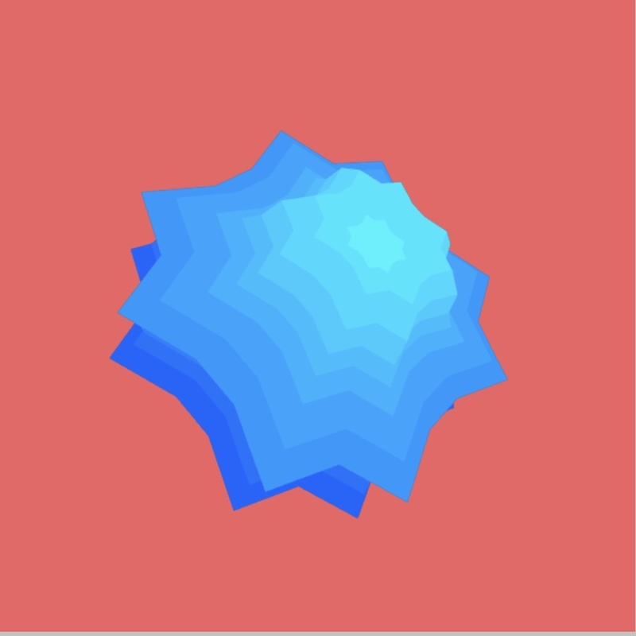
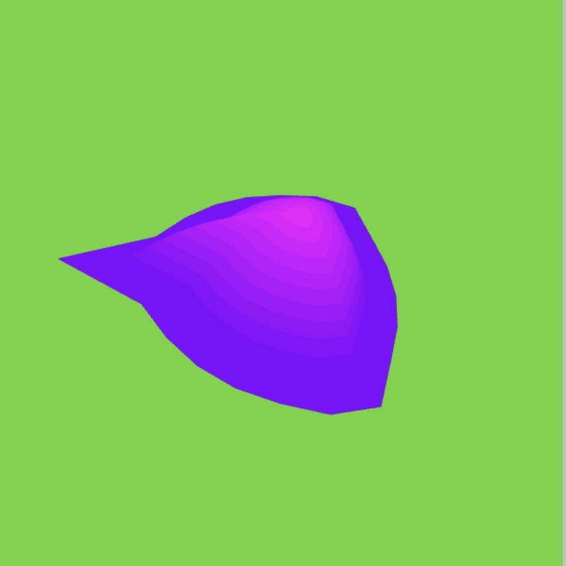
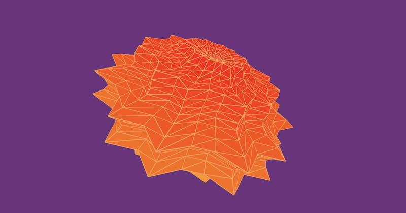

# Supershape Generator

## The genesis of my interest in shapershapes is Daniel Shiffman's wonderful Coding Train Challenge on Supershapes.

[3d Supershapes challenge] https://thecodingtrain.com/challenges/26-3d-supershapes

# Supershapes

## Definition of Supershape set from Wikipedia:

[Wikipedia page on supershapes] https://en.wikipedia.org/wiki/

## Defintion of Mandelbulb from Wikipedia

Supershapes is a three-dimensional fractal rendered using spherical coordinates.  The "nth power" formula, developed by Daniel White and Paul Nylander, for the vector $\mathbf{v}$ = (x,y,z) in $\mathbb{R}^3$ is:

$v^n := r^n\left[ \begin{array}{ccc}\sin(n\theta)cos(n\phi), sin(n\theta)sin(n\phi), cos(n\theta)\end{array} \right]$

where

r = $\sqrt{x^2 + y^2 + z^2}$,

$\phi = \arctan\[{y}{x}\]$,

$\theta = \arctan\[\sqrt{x^2 + y^2}{z}]$

Obviously, this is really complex math!!

## 1.  

## 2.  Inigo Quilez has done pioneering work on shaders and is the co-creator of shadertoy.  I have used some of his techniques in the .frag file.  His website contains a wealth on information on shaders.
- [Inigo Quilez website] https://iquilezles.org

## 3.  Martijn Steinrucken has some wonderful wonderful shader tutorials on youtube.  I have used his ray marching starting point in my frag files.  If you want a really good explanation of ray marching, I highly recommend you watch his videos on the topic! He also has a wonderful video on the mandelbrot set where he compares the 

- [YouTube: youtube.com/TheArtOfCodeIsCool] https://www.youtube.com/watch?v=PGtv-dBi2wE
- [Ray marching starting point] https://www.shadertoy.com/view/WtGXDD

## 4.  
- [Ray Marching and Signed Distance Functions] http://jamie-wong.com/2016/07/15/ray-marching-signed-distance-functions/
- [Link to shadertoy code] https://www.shadertoy.com/view/lt33z7

This p5.js sketch renders supershapes using several different methods to obtain different 3D shapes.  

## Geometry

- [Supershape P5.js sketch] https://editor.p5js.org/kfahn/full/LvvD5bLu7
- [Link to Code] https://editor.p5js.org/kfahn/sketches/LvvD5bLu7

## Shaders

### Mixing two different shapes

- [Shader -- Mixing Two Shapes] https://editor.p5js.org/kfahn/full/ox3GdxXTJ
- [Link to code] https://editor.p5js.org/kfahn/sketches/ox3GdxXTJ
