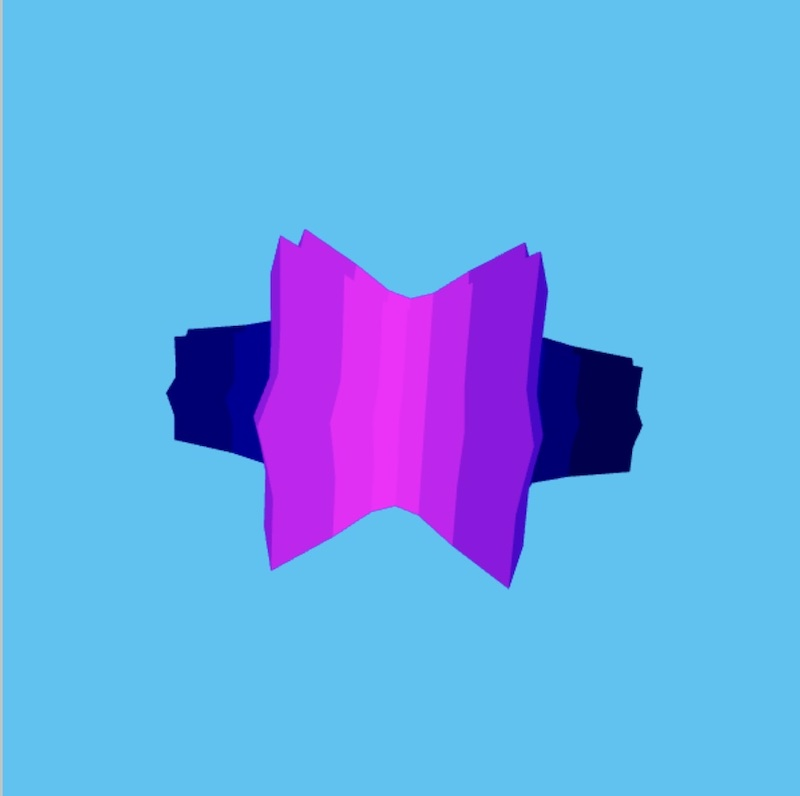
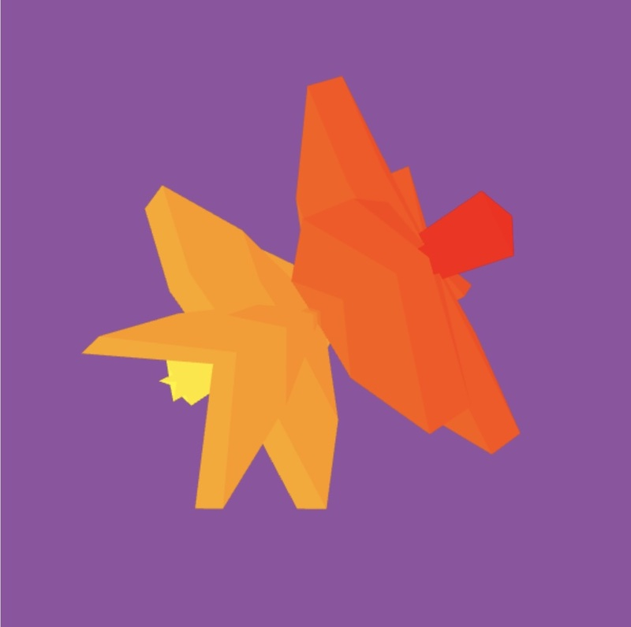
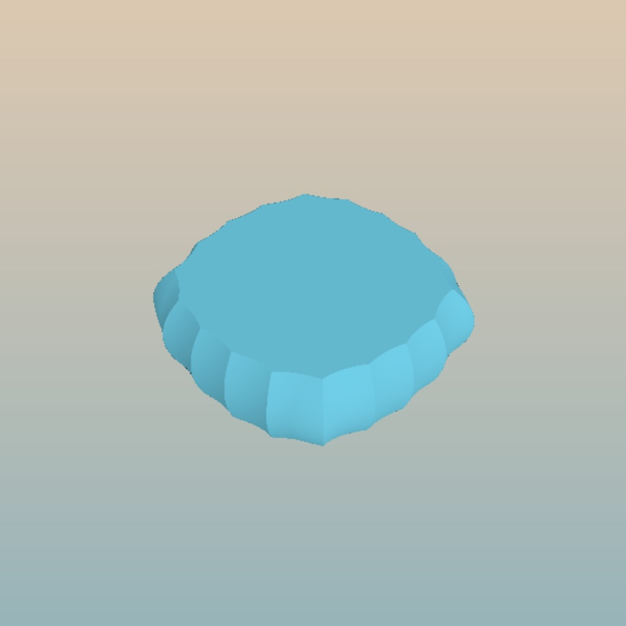
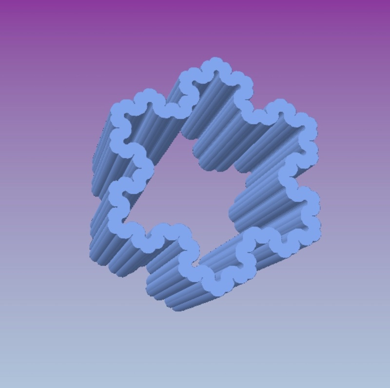
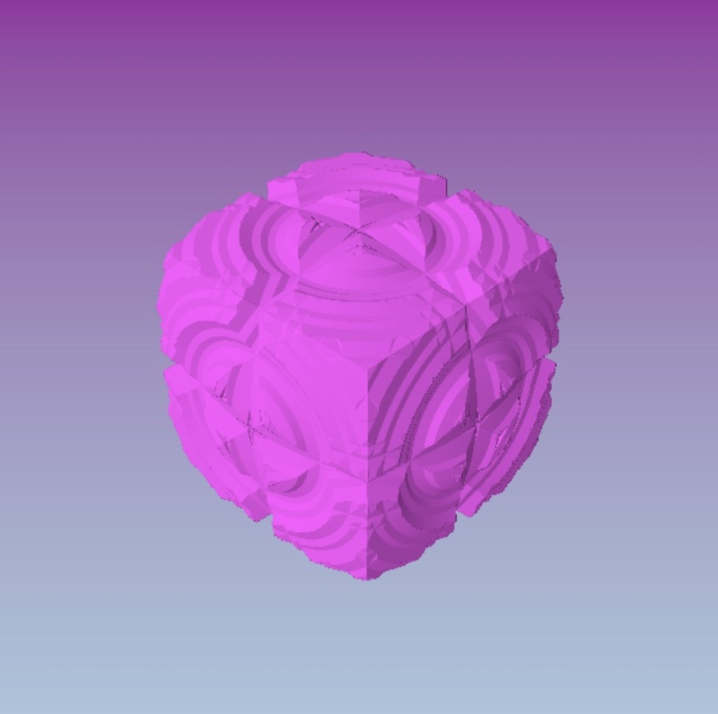

# 3D SUPER shapes

## The genesis of my interest in shapershapes is Daniel Shiffman's wonderful Coding Train Challenge on Supershapes.

[3d Supershapes challenge] https://thecodingtrain.com/challenges/26-3d-supershapes

The supershape is a generalization of the superellipse, and was proposed by Johan Gielis.  The 3D version is an extension using spherical coordinates.

[Wikipedia page on supershapes] https://en.wikipedia.org/wiki/Superformula

The supershape formula is really complex math!  Lucky, we don't have to completely understand the formula to use it to create some really fun shapes, although watching Daniel Shiffman's Coding Challenge video is a great start!!

## Rendering 3D supershapes using the superformula

  These shapes were rendered in p5.js using a port of the code that Daniel Shiffman wrote in Processing in his Supershape Coding Challenge. 

    

- [Supershape P5.js sketch] https://editor.p5js.org/kfahn/full/LvvD5bLu7
- [Link to Code] https://editor.p5js.org/kfahn/sketches/LvvD5bLu7

## Shaders

  You can also render fun SUPER shapes using a shader.  To do this in p5.js, you must load a frag file.  It utilizes the GPU, so the rendering is very fast.  You can make some really crazy awesome shapes using a shader.  Shaders use ray-marching instead of rendering a mesh on vertices.  If you are not familar with ray-marching, here are some excellent resources.

 Inigo Quilez has done pioneering work on shaders and is the co-creator of shadertoy, another  place you can write shaders. His website contains a wealth of information on shaders!!

  - [Inigo Quilez website] https://iquilezles.org
  - [Inigo Quilez youtube channel] https://www.youtube.com/c/InigoQuilez

 Jamie Wong has a nice article on Ray Marching and Signed Distance Functyions.
 [Ray Marching and Signed Distance Functions] http://jamie-wong.com/2016/07/15/ray-marching-signed-distance-functions/

 Here are some wonderful tutorials by Daniel Shiffman: 
 - [Ray Casting 2d Coding Challenge] https://thecodingtrain.com/challenges/145-ray-casting-2d
 - [Rendering Raycasting Coding challenge] https://thecodingtrain.com/challenges/146-rendering-ray-casting

 Here is an awesome tutorial on ray marching by Martijn Steinrucken:
  - [Ray Marching for Dummies by The Art of Code] https://www.youtube.com/watch?v=PGtv-dBi2wE
 

### Mixing two different shapes

  In this method, we start with a 2D shape and mix by a percentage with a 3D shape.  Suppose you have always wondered, what would happen if you mixed a star with a circle (image on left)?  Now you can find out.  What about a Koch curve and a box?  Believe it or not, you can do that too (image on right)!

- [Shader -- Mixing Two Shapes] https://editor.p5js.org/kfahn/full/ox3GdxXTJ
- [Link to code] https://editor.p5js.org/kfahn/sketches/ox3GdxXTJ

### Extrusions

   In this method, akin to using a playdough mold to form a shape, we extrude through a 2D shape to obtain a 3D shape.  The 2D sdf's are from Inigo Quilez, who has spent a great deal of time optimizing them.  The extrusion function is also from Inigo Quilez.  The 2d SDF's have to be precise, or this method won't work.  Even with Inigo Quilez's SDF's, there is a little bit of aliasing on the extruded star (probably my fault).
   
   
   

- [Shader -- Extrusion] https://editor.p5js.org/kfahn/full/6W1gXtNUi
- [Link to code] https://editor.p5js.org/kfahn/sketches/6W1gXtNUi

### Rotation method -- illustrated with the Koch fractal

  In this method, from Martijn Steinrucken, the Koch fractal is rotated on all three axis and then the boolean intersection is taken.

  [How to turn your 2d fractal into 3d!] https://www.youtube.com/watch?v=__dSLc7-Cpo

<!--  -->

- [Shader -- Rotations] https://editor.p5js.org/kfahn/full/enksfyy-t
- [Link to code] https://editor.p5js.org/kfahn/sketches/enksfyy-t