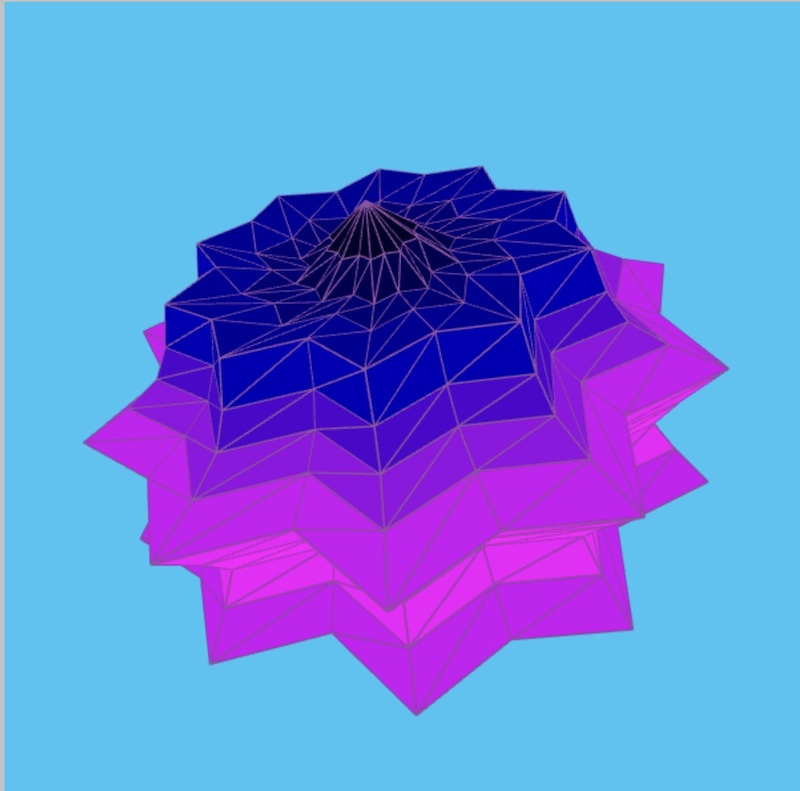
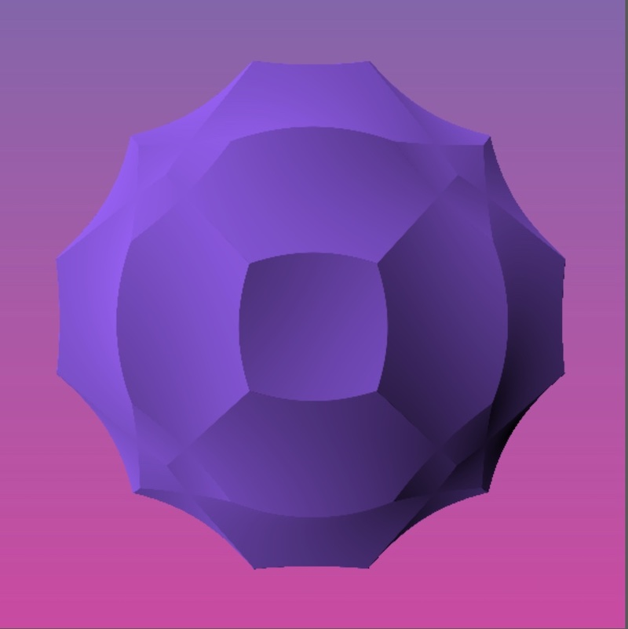
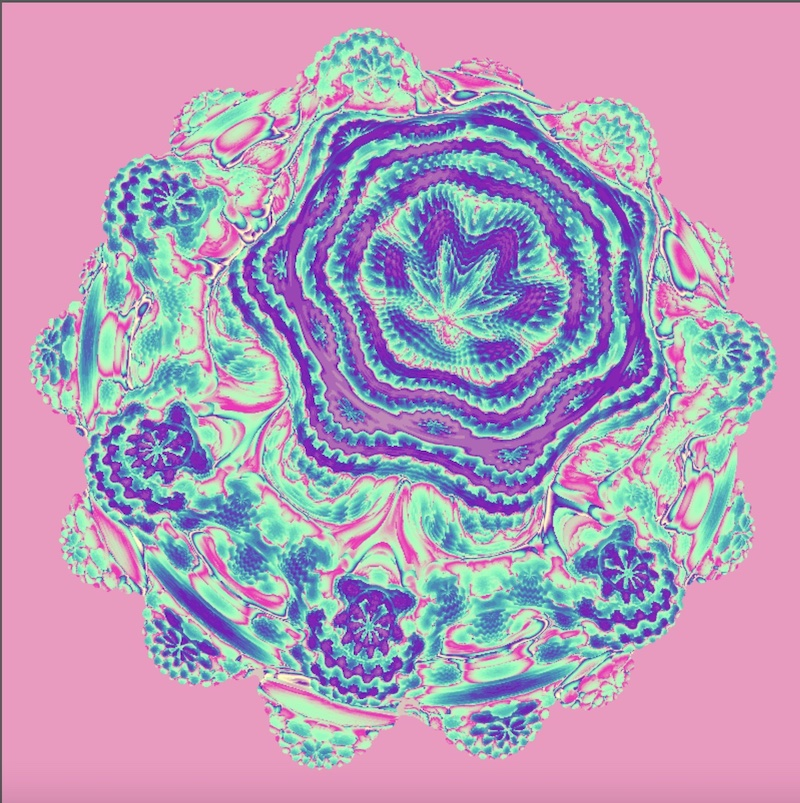

# 3D SUPER shapes

 I became interested in supershapes after watching several of Daniel Shiffman's Coding Train Challenges on supershapes.  The supershape is a generalization of the superellipse, and was proposed by Johan Gielis.  The 3D version is an extension using spherical coordinates.  The supershape formula is really complex.  Luckily, you don't have to completely understand the formula to use it to create some really fun shapes, although watching Daniel Shiffman's Coding Challenge videos will certainly help.

[Superellipse challenge] https://thecodingtrain.com/challenges/19-superellipse
[2d Supershape challenge] https://thecodingtrain.com/challenges/23-2d-supershapes
[Spherical geometry] https://thecodingtrain.com/challenges/25-spherical-geometry
[3d Supershape challenge] https://thecodingtrain.com/challenges/26-3d-supershapes

[Wikipedia page on supershapes] https://en.wikipedia.org/wiki/Superformula
[Paul Bourke webpage on supershapes] http://paulbourke.net/geometry/supershape/

## 3D supershape generator rendered with vertices and mesh

  These shapes were rendered in p5.js using a port of the code that Daniel Shiffman wrote in Processing in his Supershape Coding Challenge. This method applies a mesh to the vertices calculated from the superformula.  This is illustrated in the top left image, where the stroke is drawn.  In the other images, I have removed the stroke and varied the parameters to the supershape.  I have created a supershape generator with sliders and color options, so you can experiment with the parameters.

    

- [Live version] 
- [Supershape P5.js sketch] https://editor.p5js.org/kfahn/full/LvvD5bLu7
- [Link to Code] https://editor.p5js.org/kfahn/sketches/LvvD5bLu7

## 3D Supershape generator with a shader 

  I have also rendered the supershape using a shader.  To do this in p5.js, you must load a frag file.  It utilizes the GPU, so the rendering is very fast.  The shader renders 3D shapes by ray-marching instead of rendering a mesh on vertices.  If you are not familar with ray-marching, here are some excellent resources.

 Inigo Quilez has done pioneering work on shaders and is the co-creator of shadertoy, which is another place you can write shaders. His website contains a wealth of information on shaders.

  - [Inigo Quilez website] https://iquilezles.org
  - [Inigo Quilez youtube channel] https://www.youtube.com/c/InigoQuilez

 Jamie Wong has a great article on Ray Marching and Signed Distance Functions.
 - [Ray Marching and Signed Distance Functions] http://jamie-wong.com/2016/07/15/ray-marching-signed-distance-functions/

 Here are some wonderful tutorials by Daniel Shiffman: 
 - [Ray Casting 2d Coding Challenge] https://thecodingtrain.com/challenges/145-ray-casting-2d
 - [Rendering Raycasting Coding challenge] https://thecodingtrain.com/challenges/146-rendering-ray-casting

 Here is an awesome tutorial on ray marching by Martijn Steinrucken:
  - [Ray Marching for Dummies by The Art of Code] https://www.youtube.com/watch?v=PGtv-dBi2wE

 Images of supershape rendered with a shader.  Fair warning:  one thing you will soon find out if use the generator is that it is possible to enter parameters that violate the SDF and lead to distortions in the rendering. 

 
 

- [Link to p5sketch] https://editor.p5js.org/kfahn/full/pNgfhTXfN
- [Link to code] https://editor.p5js.org/kfahn/sketches/pNgfhTXfN

 ## SUPER shapes rendered with a shader using other methods

 ### Rotation method 

  In his tutorial "How to turn your 2d fractal into 3d!", the very clever and creative Martijn Steinrucken created a 3D Koch shape by rotating the fractal on all three axes and then taking the boolean intersection. You can do something similar with a 2D signed distance functions (SDF), which essentially calculate the distance from the surface of the shape to the center of the screen. I have used this technique to create a variant of the 3D supershape.  Again, it is possible to enter parameters that violate the SDF and lead to distortions in the rendering. 

  [How to turn your 2d fractal into 3d!] https://www.youtube.com/watch?v=__dSLc7-Cpo

    

- [p5sketch -- Supershape w/ Rotations] https://editor.p5js.org/kfahn/full/eWeMOTKqz
- [Link to code] -- https://editor.p5js.org/kfahn/sketches/eWeMOTKqz

  I have also created some 3D shapes using other 2D shapes.  The image on the left shows a 3D hexagram, while the image on the right shows a 3D star.  (The 2D SDFs are from Inigo Quilez and are available on his website.)

- [p5sketch -- Shader w/ Rotations] https://editor.p5js.org/kfahn/full/bveKzyp2D
- [Link to code] https://editor.p5js.org/kfahn/sketches/bveKzyp2D

### Mixing two different shapes

  In this method, we start with a 2D shape and mix by a percentage with a 3D shape.  Suppose you have always wondered, what would happen if you mixed a star with a circle?  Now you can find out (image on left).  What about mixing the Koch curve and a box?  Believe it or not, you can do that too (image on right).

- [Shader -- Mixing Two Shapes] https://editor.p5js.org/kfahn/full/ox3GdxXTJ
- [Link to code] https://editor.p5js.org/kfahn/sketches/ox3GdxXTJ

### Extrusions

   In this method, akin to using a playdough mold to form a shape, we extrude through a 2D shape to obtain a 3D shape.  The 2D SDF's are again from Inigo Quilez, who has spent a great deal of time optimizing them.  The extrusion function is also from Inigo Quilez.  The 2D SDF's have to be precise, or this method won't work.  Even with Inigo Quilez's SDF's, there is a little bit of aliasing on the extruded star (probably my fault).
   
   
     

- [Shader -- Extrusion] https://editor.p5js.org/kfahn/full/6W1gXtNUi
- [Link to code] https://editor.p5js.org/kfahn/sketches/6W1gXtNUi

## The Mandelbulb

  What discussion of super shapes would be complete without the ultimate SUPER shape, the mandelbulb?  Here are a couple of images of the mandelbulb.  If you want to learn more, check out my repo.

 
     

  [Link to mandelbulb repo] https://github.com/kfahn22/mandelbulb
